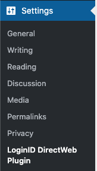
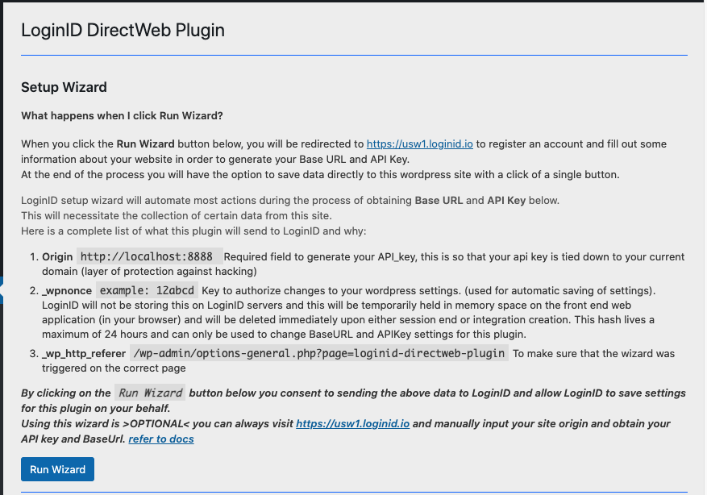
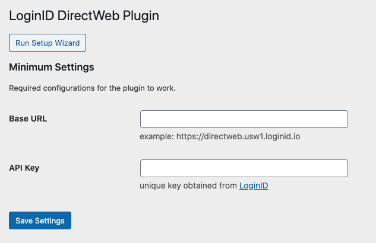

<!-- PROJECT SHIELDS -->

[![Contributors][contributors-shield]][contributors-url]
[![Forks][forks-shield]][forks-url]
[![Stargazers][stars-shield]][stars-url]
[![Issues][issues-shield]][issues-url]
[![MIT License][license-shield]][license-url]
[![LinkedIn][linkedin-shield]][linkedin-url]

<!-- PROJECT LOGO -->
<br />
<p align="center">
  <a href="https://loginid.io">
    
  </a>

  <h3 align="center">LoginID DirectWeb</h3>

  <p align="center">
    For WordPress
    <br />
    <br />
    <a href="https://github.com/loginid1/loginid-directweb/issues">Report Bug</a>
    ·
    <a href="https://github.com/loginid1/loginid-directweb/issues">Request Feature</a>
  </p>
</p>

<!-- TABLE OF CONTENTS -->

## Table of Contents

- [Table of Contents](#table-of-contents)
- [About The Project](#about-the-project)
- [Getting Started](#getting-started)
  - [Prerequisites](#prerequisites)
  - [WordPress Setup Guide](#wordpress-setup-guide)
  - [Building From Source](#building-from-source)
- [Roadmap](#roadmap)
- [License](#license)
- [Contact](#contact)
- [Acknowledgements](#acknowledgements)

<!-- ABOUT THE PROJECT -->

## About The Project

WordPress Plugin to enable a passwordless login experience using LoginID's Direct Web API.

This plugin will add two custom short codes `[loginid_login]` and `[loginid_registration]`. These two short codes will generate a login form and a register form that will use LoginID's DirectWeb API to authenticate the user without a password.

The user must have a FIDO2 compatible device, otherwise this form will default back to using a password authentication instead.

This plugin is compatible with WordPress' default password login, so this should be compatible with existing authentication plugins.

<!-- GETTING STARTED -->

## Getting Started

### Prerequisites

As this is a wordpress plugin this project requires wordpress to run.

(OPTIONAL) If you wish to modify the Javascript source files and/or PHP dependancies within this project, then you would also need to nave Node, NPM, and Composer installed.

### WordPress Setup Guide

1. Install the plugin (through the zip file or through the wordpress plugin store)
2. Configure the plugin under Settings > LoginID DirectWeb (as shown in the image below)

   

3. Choose one of the following methods of obtaining your Base URL and API Key from LoginID. You can either

   - Run the setup Wizard by clicking on the `Run Setup Wizard` button. An expanded menu will be displayed to disclose exactly what this wizard does. It sends some of your site information directly to LoginID so the create integration form will be pre-populated with data, and presents you with the option to directly save the BaseURL and API Key directly to your wordpress site. (You can always perform this action manually).



- Or Visit [LoginID Dashboard](https://sandbox-usw1.api.loginid.io/integrations) on the integrations page, and manually input required site data. This method will collect less data, but requires you to manually copy and paste over the BaseURL and API Key from LoginID.(shown in the following two screenshots).

Copy from the LoginID dashboard


To the plugin dashboard



4. Add `[loginid_login]` and `[loginid_registration]` to your login and register pages for the form to be displayed. (Note that the forms will not be shown when the user is logged in.)

### Building From Source

1. Go to your wordpress plugin folder

```sh
cd htdocs/wp-contents/plugins
```

2. Download or clone this repo

```sh
git clone https://github.com/loginid1/loginid-directweb.git
```

3. Install php dependencies

```sh
composer install
```

4. Open up wordpress and configure the plugin (refer to above)
5. (Optional) Editing javascript. Edit stuff in srcjs and don't edit javascript in includes (its minified and generated from files in srcjs anyway). You'll need nodejs to run though.
6. (Optional) Build your own javascript files

```sh
npm i
npm run dev
```

<!-- ROADMAP -->

## Roadmap

See the [open issues](https://github.com/loginid1/loginid-directweb/issues) for a list of proposed features (and known issues).

<!-- LICENSE -->

## License

Distributed under the GPLv3 License. See `LICENSE` for more information.

<!-- CONTACT -->

## Contact

LoginID - dev@loginid.io

If you need plugin help feel free to contact jimmy@loginid.io (usually reply within 48 hours).

Project Link: [https://github.com/loginid1/loginid-directweb](https://github.com/loginid1/loginid-directweb)

<!-- ACKNOWLEDGEMENTS -->

## Acknowledgements

- [The Best Readme Template on Github](https://github.com/othneildrew/Best-README-Template)
- [WordPress Starter Plugin](https://github.com/arunbasillal/WordPress-Starter-Plugin)

<!-- MARKDOWN LINKS & IMAGES -->
<!-- https://www.markdownguide.org/basic-syntax/#reference-style-links -->

[contributors-shield]: https://img.shields.io/github/contributors/loginid1/loginid-directweb.svg?style=flat-square
[contributors-url]: https://github.com/loginid1/loginid-directweb/graphs/contributors
[forks-shield]: https://img.shields.io/github/forks/loginid1/loginid-directweb.svg?style=flat-square
[forks-url]: https://github.com/loginid1/loginid-directweb/network/members
[stars-shield]: https://img.shields.io/github/stars/loginid1/loginid-directweb.svg?style=flat-square
[stars-url]: https://github.com/loginid1/loginid-directweb/stargazers
[issues-shield]: https://img.shields.io/github/issues/loginid1/loginid-directweb.svg?style=flat-square
[issues-url]: https://github.com/loginid1/loginid-directweb/issues
[license-shield]: https://img.shields.io/github/license/loginid1/loginid-directweb.svg?style=flat-square
[license-url]: https://github.com/loginid1/loginid-directweb/blob/master/LICENSE
[linkedin-shield]: https://img.shields.io/badge/-LinkedIn-black.svg?style=flat-square&logo=linkedin&colorB=555
[linkedin-url]: https://linkedin.com/in/loginid
[product-screenshot]: images/screenshot.png
